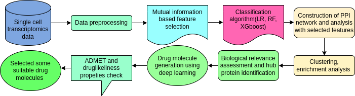
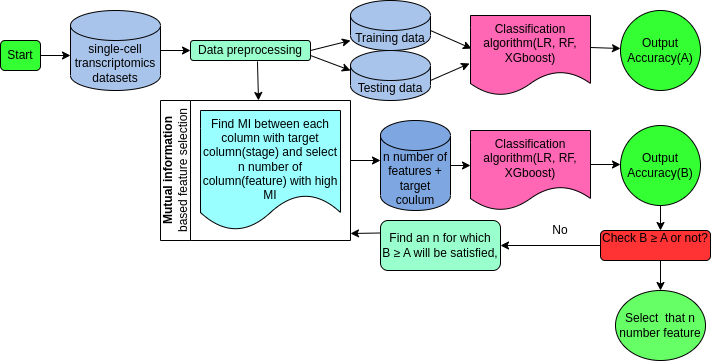

# Computational approach for decoding Malaria Drug targets from Single-Cell Transcriptomics and finding potential drug molecules
 <!-- Add this line with the correct path -->

***Flowchart of the pipeline of our whole work** <!-- Add your description -->


 <!-- Add this line with the correct path -->

***Pipeline of the mutual information-based feature reduction technique** <!-- Add your description -->


<br />
<div align="center">
  
<h3 align="center"Computational approach for decoding Malaria Drug targets from Single-Cell Transcriptomics and finding potential drug molecules</h3>

 
</div>


<!-- TABLE OF CONTENTS -->
<details>
  <summary>Table of Contents</summary>
  <ol>
    <li>
      <a href="#about-the-project">About The Project</a>
      <ul>
        <li><a href="#built-with">Built With</a></li>
      </ul>
    </li>
    <li>
      <a href="#getting-started">Getting Started</a>
      <ul>
        <li><a href="#prerequisites">Prerequisites</a></li>
        <li><a href="#installation">Installation</a></li>
        <li><a href="#how_to_run">How to run</a></li>
      </ul>
    </li>
    <li><a href="#usage">File details and workflow of the project</a></li>
    <li><a href="#license">License</a></li>
    <li><a href="#contact">Contact</a></li>
    
  </ol>
</details>


<!-- ABOUT THE PROJECT -->
## About The Project

Malaria, caused by Plasmodium parasites, remains a formidable global health challenge. The World Malaria Report 2022 states that there were 619,000 malaria deaths (uncertainty range 577,000–754000) and 247 million estimated malaria cases (uncertainty range 224–276 million) worldwide in 2021. Over 200 million cases and nearly half a million deaths are reported annually. Numerous drugs have been available since 1900, but It’s essential to note that the emergence of drug-resistant variants of the malaria parasite, mainly Plasmodium falciparum, has called into question the efficacy of these drugs. The incorporation of single-cell transcriptome analysis represents a major development in this endeavor. This research aims to explore the promise of single-cell transcriptomic analysis as a powerful tool for identifying crucial proteins as a drug target. Then, we found some suitable drug molecules for this target using deep learning models. We have implemented mutual-information-based feature reduction algorithm with a classification algorithm to select important features from datasets for our analysis. Next, we find some crucial proteins that are important for plasmodium survival using protein-protein interaction network. We find the function and strong binding sites of these crucial proteins. Based on these strong binding sites, we generated drug molecules using a deep learning-based technique and found some lead drug molecules using ADMET and drug-likeliness properties. After selecting drug molecules, we performed docking with the respective proteins and found the binding affinities of each drug molecule with the respective protein. This approach allows for identifying subtle variations in gene expression within individual cells, which is crucial for capturing the dynamic responses of different parasite stages. Network-driven analyses in single-cell studies unveil the crucial proteins that are important for plasmodium survival in sexual and asexual stages.


<p align="right">(<a href="#top">back to top</a>)</p>


### Built With

* Python 3.6
* sklearn


<p align="right">(<a href="#top">back to top</a>)</p>


<!-- GETTING STARTED -->
## Getting Started

These are the steps to follow and run this project:
### Prerequisites


* pip install all the required libraries.
  

### Installation


1. Clone the repo
   ```sh
   git clone https://github.com/soham2-4/Malaria-Drug-Targets-finding-from-Single-Cell-Transcriptomics-and-genertaing-potential-drug-molecule.git
   ```
2. Install pip packages
   ```sh
   pip3 install ....
   ```
3. Run python files in code folder
   ```sh
   python without_featureselection.py (get classification result without feature selection)
   python MI_feature_reduction.py (get classification result with feature selection)
   python random_feature.py (get classification result with random feature selection)
   classification_results.ipynb (get bar chats of classification accuracies)
   UMAP.ipynb (get UMAP of datasets before feature selection and after feature selection)
   enrichment.ipynb (bar charts of enriched biological functions)
   ```

  
<p align="right">(<a href="#top">back to top</a>)</p>


<!-- USAGE EXAMPLES -->
## File Details and workflow of the project

* Datasets: Three datasets are given in the Datasets folder. 

* Data preprocessing: The datasets given in this repository are preprocessed. We have collected raw datasets from three papers(details in the paper). Then, we preprocessed these datasets to get a meaningful representation of our work.

* Feature selection using mutual-information-based feature reduction technique:  Code folder has all the python files.'without_featureselection.py' can be used to get the classification results before feature selection. 'MI_feature_reduction.py' can be used to get the classification result after selecting features using Mutual information-based feature selection. 'random_feature.py' selects random features from the dataset and gets classification results. classification_results.ipynb plots bar charts of comparisons between different classifiers. All the selected features can be found in 1st dataset. 2nd dataset and 3rd dataset folders. For all the details, please check instructions in 1st.txt, 2nd.txt, 3rd.txt of the respective 1st, 2nd and 3rd dataset folders.

* Protein-protein interaction network analysis: After feature selection, we did Protein-protein interaction network analysis with these features. All the results can be found in 1st dataset. 2nd dataset and 3rd dataset folders. With these selected features, we did enrichment analysis of biological functions.

* Crucial proteins: After doing Protein-protein interaction network analysis, we selected crucial proteins from these networks with high degree and betweenness centrality and found their importance for plasmodium survival. 

* Suggested drug molecules using Targetdiff: Next, we found strong binding sites of crucial proteins and generated drug molecules using targetdiff(a generated deep learning framework).

* ADMET and drug-likeliness: In this step, we analyzed ADMET and drug-likeliness properties of all the generated drug molecules and found some drug molecules that can work as potential drug molecules. All the results can be found in 1st dataset. 2nd dataset and 3rd dataset folders.


<p align="right">(<a href="#top">back to top</a>)</p>


<!-- LICENSE -->
## License

Distributed under the MIT License. See `LICENSE` for more information.

<p align="right">(<a href="#top">back to top</a>)</p>


<!-- CONTACT -->
## Contact

Your Name - Soham Choudhuri - soham.choudhuri@research.iiit.ac.in

Project Link: [https://github.com/soham2-4/Malaria-Drug-Targets-finding-from-Single-Cell-Transcriptomics-and-genertaing-potential-drug-molecule/tree/main](https://github.com/soham2-4/Malaria-Drug-Targets-finding-from-Single-Cell-Transcriptomics-and-genertaing-potential-drug-molecule/tree/main)

<p align="right">(<a href="#top">back to top</a>)</p>


